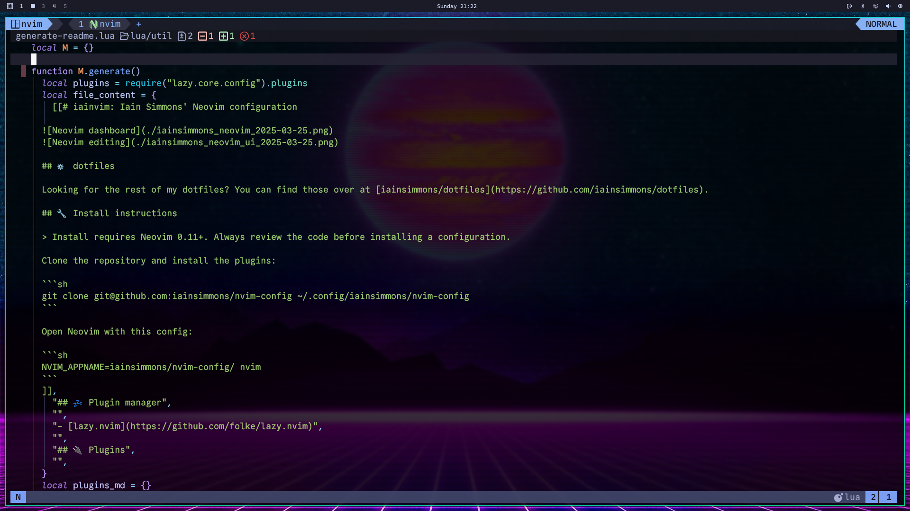
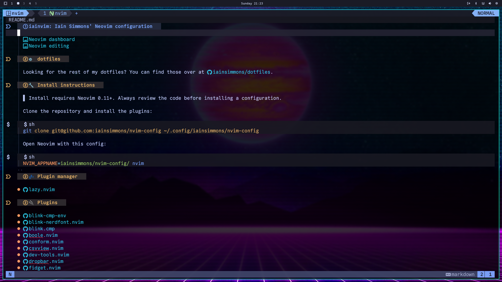

# iainvim: Iain Simmons' Neovim configuration





## ⚙️ dotfiles

Looking for the rest of my dotfiles? You can find those over at [iainsimmons/dotfiles](https://github.com/iainsimmons/dotfiles).

## 🔧 Install instructions

> Install requires Neovim 0.11+. Always review the code before installing a configuration.

Clone the repository and install the plugins:

```sh
git clone git@github.com:iainsimmons/nvim-config ~/.config/iainsimmons/nvim-config
```

Open Neovim with this config:

```sh
NVIM_APPNAME=iainsimmons/nvim-config/ nvim
```

## 💤 Plugin manager

- [lazy.nvim](https://github.com/folke/lazy.nvim)

## 🔌 Plugins

- [blink-cmp-env](https://github.com/bydlw98/blink-cmp-env)
- [blink-nerdfont.nvim](https://github.com/MahanRahmati/blink-nerdfont.nvim)
- [blink.cmp](https://github.com/saghen/blink.cmp)
- [boole.nvim](https://github.com/Susensio/boole.nvim)
- [conform.nvim](https://github.com/stevearc/conform.nvim)
- [csvview.nvim](https://github.com/hat0uma/csvview.nvim)
- [dev-tools.nvim](https://github.com/yarospace/dev-tools.nvim)
- [dropbar.nvim](https://github.com/Bekaboo/dropbar.nvim)
- [fidget.nvim](https://github.com/j-hui/fidget.nvim)
- [flash.nvim](https://github.com/folke/flash.nvim)
- [friendly-snippets](https://github.com/rafamadriz/friendly-snippets)
- [grug-far.nvim](https://github.com/MagicDuck/grug-far.nvim)
- [highlight-undo.nvim](https://github.com/tzachar/highlight-undo.nvim)
- [kulala.nvim](https://github.com/mistweaverco/kulala.nvim)
- [lazy.nvim](https://github.com/folke/lazy.nvim)
- [lazydev.nvim](https://github.com/folke/lazydev.nvim)
- [lua-json5](https://github.com/Joakker/lua-json5)
- [mason-lspconfig.nvim](https://github.com/williamboman/mason-lspconfig.nvim)
- [mason-nvim-dap.nvim](https://github.com/jay-babu/mason-nvim-dap.nvim)
- [mason-tool-installer.nvim](https://github.com/WhoIsSethDaniel/mason-tool-installer.nvim)
- [mason.nvim](https://github.com/williamboman/mason.nvim)
- [mini.nvim](https://github.com/echasnovski/mini.nvim)
- [neoconf.nvim](https://github.com/folke/neoconf.nvim)
- [noice.nvim](https://github.com/folke/noice.nvim)
- [nui.nvim](https://github.com/MunifTanjim/nui.nvim)
- [nvim-bqf](https://github.com/kevinhwang91/nvim-bqf)
- [nvim-dap-view](https://github.com/igorlfs/nvim-dap-view)
- [nvim-dap-virtual-text](https://github.com/theHamsta/nvim-dap-virtual-text)
- [nvim-dap](https://github.com/mfussenegger/nvim-dap)
- [nvim-highlight-colors](https://github.com/brenoprata10/nvim-highlight-colors)
- [nvim-lint](https://github.com/mfussenegger/nvim-lint)
- [nvim-lspconfig](https://github.com/neovim/nvim-lspconfig)
- [nvim-markdown-preview](https://github.com/davidgranstrom/nvim-markdown-preview)
- [nvim-treesitter-context](https://github.com/nvim-treesitter/nvim-treesitter-context)
- [nvim-treesitter-textobjects](https://github.com/nvim-treesitter/nvim-treesitter-textobjects)
- [nvim-treesitter](https://github.com/nvim-treesitter/nvim-treesitter)
- [nvim-ts-autotag](https://github.com/windwp/nvim-ts-autotag)
- [nvim-ts-context-commentstring](https://github.com/JoosepAlviste/nvim-ts-context-commentstring)
- [nvim-ufo](https://github.com/kevinhwang91/nvim-ufo)
- [persistence.nvim](https://github.com/folke/persistence.nvim)
- [plenary.nvim](https://github.com/nvim-lua/plenary.nvim)
- [promise-async](https://github.com/kevinhwang91/promise-async)
- [reactive.nvim](https://github.com/rasulomaroff/reactive.nvim)
- [refactoring.nvim](https://github.com/ThePrimeagen/refactoring.nvim)
- [render-markdown.nvim](https://github.com/MeanderingProgrammer/render-markdown.nvim)
- [smear-cursor.nvim](https://github.com/sphamba/smear-cursor.nvim)
- [snacks.nvim](https://github.com/folke/snacks.nvim)
- [snipe.nvim](https://github.com/leath-dub/snipe.nvim)
- [text-case.nvim](https://github.com/johmsalas/text-case.nvim)
- [todo-comments.nvim](https://github.com/folke/todo-comments.nvim)
- [tokyonight.nvim](https://github.com/folke/tokyonight.nvim)
- [undotree](https://github.com/mbbill/undotree)
- [vim-sleuth](https://github.com/tpope/vim-sleuth)
- [vscode-diff.nvim](https://github.com/esmuellert/vscode-diff.nvim)
- [wezterm-types](https://github.com/justinsgithub/wezterm-types)
- [which-key.nvim](https://github.com/folke/which-key.nvim)

## Generating this README

To generate this file, run this util function:

```vim
:lua require("util.generate-readme").generate()
```

You should see a message "README.md successfully generated"

You can also use or change the global keymap for this:

```lua
vim.keymap.set("n", "<leader>rm", function()
  require("util.generate-readme").generate()
end, { desc = "Generate README" })
```
