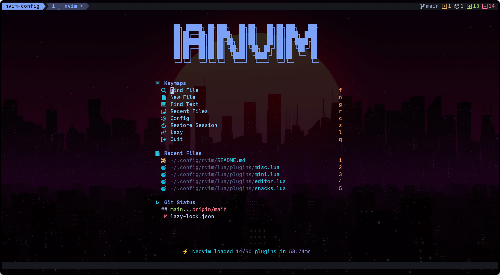
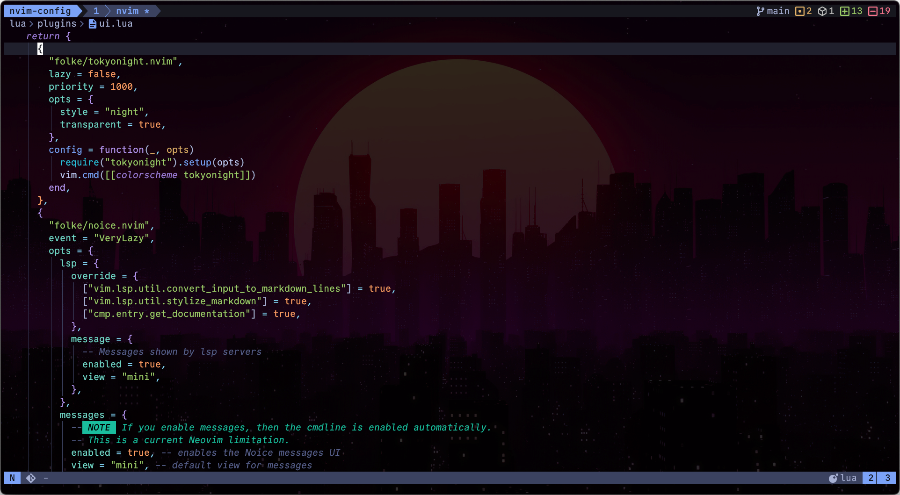

# Neovim Configuration




<a href="https://dotfyle.com/iainsimmons/nvim-config"></a>
<a href="https://dotfyle.com/iainsimmons/nvim-config"></a>
<a href="https://dotfyle.com/iainsimmons/nvim-config"></a>

## Install Instructions

> Install requires Neovim 0.11+. Always review the code before installing a configuration.

Clone the repository and install the plugins:

```sh
git clone git@github.com:iainsimmons/nvim-config ~/.config/iainsimmons/nvim-config
```

Open Neovim with this config:

```sh
NVIM_APPNAME=iainsimmons/nvim-config/ nvim
```

## Plugins

### bars-and-lines

+ [Bekaboo/dropbar.nvim](https://dotfyle.com/plugins/Bekaboo/dropbar.nvim)

### color

+ [brenoprata10/nvim-highlight-colors](https://dotfyle.com/plugins/brenoprata10/nvim-highlight-colors)
+ [rasulomaroff/reactive.nvim](https://dotfyle.com/plugins/rasulomaroff/reactive.nvim)

### colorscheme

+ [folke/tokyonight.nvim](https://dotfyle.com/plugins/folke/tokyonight.nvim)

### comment

+ [folke/todo-comments.nvim](https://dotfyle.com/plugins/folke/todo-comments.nvim)
+ [JoosepAlviste/nvim-ts-context-commentstring](https://dotfyle.com/plugins/JoosepAlviste/nvim-ts-context-commentstring)

### completion

+ [Saghen/blink.cmp](https://dotfyle.com/plugins/Saghen/blink.cmp)

### csv-files

+ [hat0uma/csvview.nvim](https://dotfyle.com/plugins/hat0uma/csvview.nvim)

### debugging

+ [mfussenegger/nvim-dap](https://dotfyle.com/plugins/mfussenegger/nvim-dap)
+ [rcarriga/nvim-dap-ui](https://dotfyle.com/plugins/rcarriga/nvim-dap-ui)
+ [theHamsta/nvim-dap-virtual-text](https://dotfyle.com/plugins/theHamsta/nvim-dap-virtual-text)

### editing-support

+ [windwp/nvim-ts-autotag](https://dotfyle.com/plugins/windwp/nvim-ts-autotag)
+ [nat-418/boole.nvim](https://dotfyle.com/plugins/nat-418/boole.nvim)
+ [tzachar/highlight-undo.nvim](https://dotfyle.com/plugins/tzachar/highlight-undo.nvim)
+ [folke/snacks.nvim](https://dotfyle.com/plugins/folke/snacks.nvim)
+ [nvim-treesitter/nvim-treesitter-context](https://dotfyle.com/plugins/nvim-treesitter/nvim-treesitter-context)

### file-explorer

+ [mikavilpas/yazi.nvim](https://dotfyle.com/plugins/mikavilpas/yazi.nvim)

### formatting

+ [stevearc/conform.nvim](https://dotfyle.com/plugins/stevearc/conform.nvim)

### icon

+ [2KAbhishek/nerdy.nvim](https://github.com/2KAbhishek/nerdy.nvim)

### keybinding

+ [folke/which-key.nvim](https://dotfyle.com/plugins/folke/which-key.nvim)

### lsp

+ [neovim/nvim-lspconfig](https://dotfyle.com/plugins/neovim/nvim-lspconfig)
+ [mfussenegger/nvim-lint](https://dotfyle.com/plugins/mfussenegger/nvim-lint)
+ [j-hui/fidget.nvim](https://dotfyle.com/plugins/j-hui/fidget.nvim)
+ [rachartier/tiny-inline-diagnostic.nvim](https://dotfyle.com/plugins/rachartier/tiny-inline-diagnostic.nvim)

### lsp-installer

+ [williamboman/mason.nvim](https://dotfyle.com/plugins/williamboman/mason.nvim)

### markdown-and-latex

+ [davidgranstrom/nvim-markdown-preview](https://dotfyle.com/plugins/davidgranstrom/nvim-markdown-preview)
+ [MeanderingProgrammer/render-markdown.nvim](https://dotfyle.com/plugins/MeanderingProgrammer/render-markdown.nvim)

### motion

+ [folke/flash.nvim](https://dotfyle.com/plugins/folke/flash.nvim)
+ [sphamba/smear-cursor.nvim](https://dotfyle.com/plugins/sphamba/smear-cursor.nvim)

### nvim-dev

+ [nvim-lua/plenary.nvim](https://dotfyle.com/plugins/nvim-lua/plenary.nvim)
+ [MunifTanjim/nui.nvim](https://dotfyle.com/plugins/MunifTanjim/nui.nvim)
+ [folke/lazydev.nvim](https://dotfyle.com/plugins/folke/lazydev.nvim)

### plugin-manager

+ [folke/lazy.nvim](https://dotfyle.com/plugins/folke/lazy.nvim)

### quickfix

+ [kevinhwang91/nvim-bqf](https://dotfyle.com/plugins/kevinhwang91/nvim-bqf)

### search

+ [MagicDuck/grug-far.nvim](https://dotfyle.com/plugins/MagicDuck/grug-far.nvim)

### session

+ [folke/persistence.nvim](https://dotfyle.com/plugins/folke/persistence.nvim)

### snippet

+ [L3MON4D3/LuaSnip](https://dotfyle.com/plugins/L3MON4D3/LuaSnip)
+ [TobinPalmer/rayso.nvim](https://dotfyle.com/plugins/TobinPalmer/rayso.nvim)
+ [rafamadriz/friendly-snippets](https://dotfyle.com/plugins/rafamadriz/friendly-snippets)

### syntax

+ [nvim-treesitter/nvim-treesitter](https://dotfyle.com/plugins/nvim-treesitter/nvim-treesitter)
+ [nvim-treesitter/nvim-treesitter-textobjects](https://dotfyle.com/plugins/nvim-treesitter/nvim-treesitter-textobjects)

### utility

+ [folke/noice.nvim](https://dotfyle.com/plugins/folke/noice.nvim)
+ [echasnovski/mini.nvim](https://dotfyle.com/plugins/echasnovski/mini.nvim)
+ [jellydn/hurl.nvim](https://dotfyle.com/plugins/jellydn/hurl.nvim)

## Language Servers

+ astro
+ basedpyright
+ emmet_ls
+ eslint
+ glint
+ html
+ htmx
+ jsonls
+ lemminx
+ lua_ls
+ marksman
+ svelte
+ tailwindcss
+ ts_ls
+ yamlls

## Formatters

+ black
+ cbfmt
+ isort
+ markdownlint
+ prettierd
+ shfmt
+ stylua
+ xmlformatter

## Linters

+ eslint
+ glint
+ markdownlint
+ stylelint

 This readme was generated by [Dotfyle](https://dotfyle.com)
